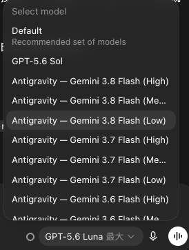

# codex-bridge-antigravity

[English](README.md) | [繁體中文](README.zh-TW.md) | [简体中文](README.zh-CN.md) | [日本語](README.ja.md)

公式 Google Antigravity CLI (`agy`) を OpenAI Codex（Desktop および CLI）にシームレスに統合し、ネイティブ GPT モデルのルーティングと認証をそのまま維持する軽量ローカル OpenAI Responses API ブリッジです。



---

## 概要

OpenAI Codex の WebSocket および HTTP エンドポイント設定は、個別モデル単位ではなく **Provider（プロバイダー）単位** で行われます。そのため、`codex-bridge-antigravity` はローカルマシン上でスマートなリバースプロキシ／ルーターとして動作します：

- **ネイティブ GPT / Codex モデル**：公式の ChatGPT / Codex バックエンドへそのまま転送され、既存の Codex Bearer ログイン認証とセッションが維持されます。
- **Antigravity モデル (`antigravity/*`)**：ローカルルーターがインターセプトし、公式 `agy` CLI の `stream-json` ストリーム実行に変換した上で、標準の OpenAI Responses 形式（SSE/WebSocket）として返却します。

これにより、同一ワークスペースかつ同一の Codex モデルドロップダウンメニューから、GPT と Gemini の各モデルを自在に切り替えて利用できます。

```
┌─────────────────────────────────────────────────────────────┐
│                        Codex Client                         │
└──────────────────────────────┬──────────────────────────────┘
                               │
                               ▼ (Provider ルート: 127.0.0.1:17842)
┌─────────────────────────────────────────────────────────────┐
│                  codex-bridge-antigravity                   │
│                                                             │
│   ┌───────────────────────────┐   ┌─────────────────────┐   │
│   │   ネイティブ GPT / Codex  │   │   antigravity/*     │   │
│   └─────────────┬─────────────┘   └──────────┬──────────┘   │
└─────────────────┼────────────────────────────┼──────────────┘
                  │                            │
                  ▼                            ▼
┌──────────────────────────────────┐   ┌──────────────────────┐
│  公式 OpenAI/ChatGPT バックエンド │   │ Google Antigravity   │
│  (Bearer トークンそのまま透過)   │   │ 公式 CLI (`agy`)     │
└──────────────────────────────────┘   └──────────────────────┘
```

---

## 主な特徴

- **完全共存**：ネイティブ GPT モデルは公式バックエンドへ直結され、Antigravity 側に送信されることはありません。
- **動的モデルカタログ同期**：`agy models` から利用可能なモデル（Gemini 3.8 Flash、Gemini 3.8 Pro など）をリアルタイムで取得・統合します。
- **Codex モデル切り替えエラーの解消**：モデル定義の `use_responses_lite = false` を適用し、Codex クライアントでのモデル切り替え時の検証エラーを防止します。
- **会話履歴の自動要約（Compaction）対応**：OpenAI Compact API 仕様に準拠した `/v1/responses/compact` エンドポイントを実装し、コンテキスト上限に近づいた際の自動要約がスムーズに機能します。
- **ワンコマンドでの設定と復元**：`setup` により `~/.codex/config.toml` を自動バックアップした上で設定し、`disconnect` でいつでも元の設定へ安全に戻せます。

### 画像入力

Antigravity モデルのルートは `input_modalities: ["text", "image"]` を宣言します。ローカル画像は `~/.codex-bridge-antigravity/cache/images` に非公開コピーとして保存され、`agy` が読み取れるようにした上で、メインターンの前に必須の画像確認を実行します。`data:image/...;base64,...`、`file://...`、ローカルファイルパス、HTTPS 画像 URL に対応し、ネイティブ GPT ルートは変更されません。

---

## 前提条件

- **Node.js**：`>= 22.0.0`
- **Google Antigravity CLI (`agy`)**：インストールおよび公式ログイン完了済みであること（`agy models` でモデル一覧が表示できる状態）。
- **OpenAI Codex**：Codex Desktop または Codex CLI がインストールされていること。

---

## クイックスタート

### 1. 環境検証と診断

リポジトリをクローンし、ローカル環境をチェックします：

```bash
git clone https://github.com/Jakevin/codex-bridge-antigravity.git
cd codex-bridge-antigravity

# 自動回帰テストの実行
npm test

# agy および Codex のパス診断
node src/cli.mjs doctor
```

### 2. ローカルデーモンの起動

ブリッジサーバーを起動します（デフォルトポート: `17842`）：

```bash
node src/cli.mjs serve --cwd "$PWD"
```

別ターミナルから直接エンドポイントをテストします：

```bash
# ヘルスチェック
curl http://127.0.0.1:17842/healthz

# モデルカタログの取得
curl http://127.0.0.1:17842/v1/models

# 応答生成テスト
curl http://127.0.0.1:17842/v1/responses \
  -H 'content-type: application/json' \
  -d '{"model":"antigravity/gemini-3.8-flash-low","input":"Reply with exactly AGY_OK"}'
```

### 3. Codex への統合

ブリッジのルーティング設定を Codex に反映します：

```bash
node src/cli.mjs setup --cwd "$PWD" --replace-codex-route
```

Codex Desktop アプリまたは Codex CLI を再起動すると、モデル選択メニューにネイティブ GPT モデルと並んで `Gemini 3.8 Flash ...` モデルが表示されます。

### 4. 設定の解除と復元

`setup` 実行前の Codex 設定に戻したい場合は、以下を実行します：

```bash
node src/cli.mjs disconnect
```

---

## 実行モード

`serve` 起動時に `--mode` オプションで AGY の動作モードを指定できます：

- **`accept-edits`（デフォルト）**：指定したワークスペース内でコーディングツールやファイル編集を自動実行します。
- **`plan`（読み取り専用プランモード）**：ファイルを直接変更せず、設計・調査・計画のみを行います：
  ```bash
  node src/cli.mjs serve --cwd "$PWD" --mode plan
  ```

---

## 環境変数と設定ファイル

設定ファイルはデフォルトで `~/.codex-bridge-antigravity/` に保存されます。

以下の環境変数で設定を上書き可能です：

| 環境変数 | 説明 | デフォルト値 |
|---|---|---|
| `PORT` | ブリッジの HTTP/WebSocket リッスンポート | `17842` |
| `AGY_PATH` | 公式 `agy` 実行バイナリのパス | `$PATH` から自動検出 |
| `CODEX_HOME` | Codex の設定ディレクトリ | `~/.codex` |
| `CODEX_ANTIGRAVITY_HOME` | ブリッジの実行状態保存ディレクトリ | `~/.codex-bridge-antigravity` |

---

## トラブルシューティング

- **Codex でのモデル切り替えエラー (`use_responses_lite`)**：本ブリッジでは `use_responses_lite` を `false` に設定しているため、Codex の検証エラーを回避できます。
- **ポート競合**：もしポート `17842` が他のプロセスによって使用されている場合は、`PORT=17845 node src/cli.mjs serve` のようにポートを変更し、`setup` を再実行してください。
- **AGY 認証切れ**：認証エラーが表示される場合は、ターミナルで `agy auth` を実行し、ブラウザで Google アカウントの再ログインを行ってください。

---

## コンプライアンスと免責事項

`codex-bridge-antigravity` は、開発者がローカル環境 (`localhost`) において自身が所有・認証したツールを連携させるための、独立した非商用の個人開発補助ツールです。

- 本プロジェクトは OpenAI または Google との公式な提携、推奨、支援関係はありません。
- ブリッジを通過するリクエストは、ユーザー自身の認証情報およびアカウント利用枠を使用します。
- マルチテナント公開ホスティング、商用再販、または各社の利用規約に反する不正なモデル蒸留行為への使用は意図されていません。

---

## ライセンス

本プロジェクトは [MIT License](LICENSE) の下で公開されています © 2026 Jakevin
